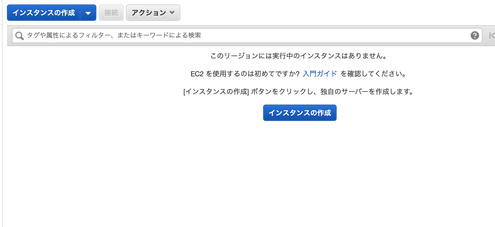
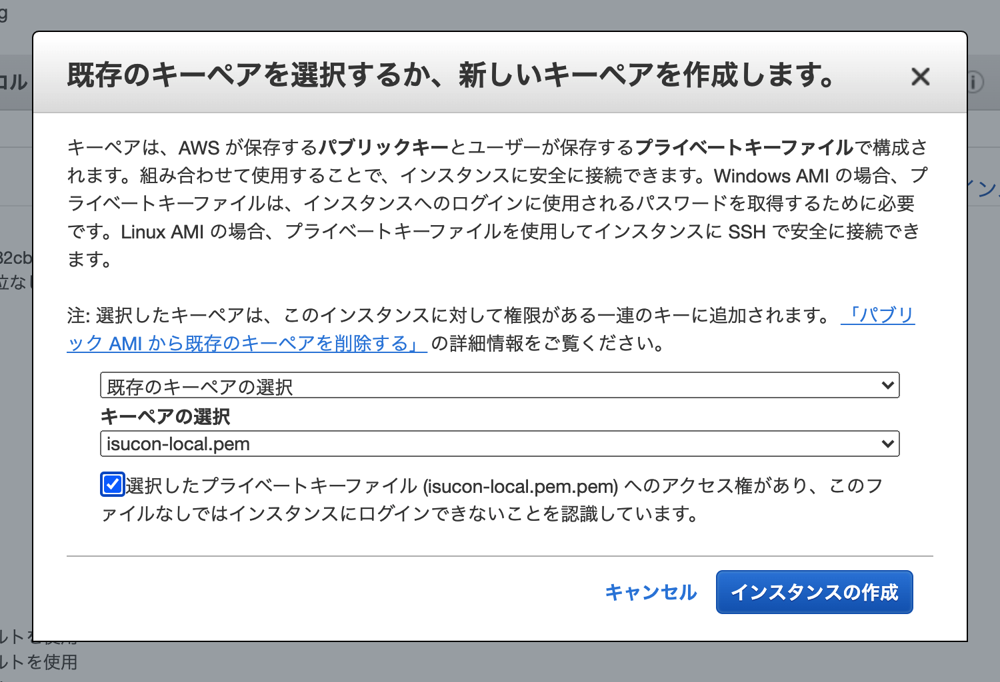

# EC2 構築手順

ISUCON で利用する EC2 の構築手順

## 前提

OS バージョン: `ubuntu 18.04`
スペック: ``ストレージ:`30GiB`

リージョンは日本の方が良い気がする

## 手順

AWS コンソールから EC2 を選択


インスタンスの作成を選択



ベースイメージは ubuntu 18.04 を選択


スペックは t3.xlarge


インスタンスの詳細設定は適宜


ストレージは 30GiB にする


この辺も適宜(img/一旦 SSH だけオープンでよいかと)


適当にキーペア作ってインスタンスの作成を選択



再起動した時に IP 変わると嫌なので EIP を予め付けておく。  
この辺で EIP を一個もらう。


IP をインスタンスに紐づける


紐づいてたら OK


ダウンロードした鍵ファイル多分 644 のパーミッションになってるので 600 にするのを忘れずに。

ここからコマンド

ターミナルで SSH ログイン後にまずアップデートする  
ssh -i ${秘密鍵パス} ubuntu@${EIP}

```sh
sudo apt update && sudo apt -y upgrade
```

途中なんか出てきたけどバージョンは変えない  


isucon ユーザを作成

```sh
sudo useradd -m isucon
sudo passwd isucon
```

パスワードは`isucon`

ログインシェルを設定

```sh
sudo usermod -s /bin/bash isucon
```

いろいろめんどいので nano から vim に変更

```sh
sudo update-alternatives --set editor /usr/bin/vim.basic
```

visudo を編集

```sh
visudo

# こんな感じにisuconユーザを追加

# User privilege specification
root    ALL=(ALL:ALL) ALL
isucon  ALL=NOPASSWD: ALL
```

ubuntu ユーザの.ssh ディレクトリをコピー、オーナー変更

```sh
sudo cp -pr ~/.ssh /home/isucon/./
sudo chown -R isucon.isucon /home/isucon/.ssh
```

これをやるとローカルからログインする時に ubuntu ユーザじゃなくて isucon ユーザでログインできる

一度ログアウト

```sh
exit
```

isucon ユーザで再度ログイン

```sh
(macから)ssh -i ${秘密鍵パス} isucon@${EIP}
```

toolbox を clone

```sh
cd && git clone https://github.com/yoshi0202/isucon2020-toolbox.git
```

preparation スクリプトを順次実行

```sh
cd ~/isucon2020-toolbox/preparation
sh install-nginx.sh
sh install-mysql.sh
# MySQLインストール時にダイアログが出てくるので一番上を選択
# MySQLのバージョンは mysql-8.0 を選択、それ以外はdisabledでOKを選択
```


途中で root パスワードを求められるので適宜入力
(スクショ撮り逃した…)その次のダイアログは `legacy` って書いてある方を選択

mysql -u root -p でログインできればまあ OK だと思う。

```sh
sh install-go.sh
# なぜかsource が効いてないので手動で実行
source ~/.bash_profile
go get -u github.com/google/pprof
sh change_host_name.sh
# 任意のホスト名に変更

# fetch_public_key.sh
# これは不要？
```

一通り設定が完了したらシャットダウンしておく

```sh
sudo shutdown -h now
```

## 備考

こんな感じの config をローカルに記載しておくと便利かも  
設定内容は適宜

```
Host isucon-local
HostName 54.248.194.192
User isucon
IdentityFile ~/.ssh/isucon-localpem.pem
```

これで  
ssh -i ~/.ssh/isucon-localpem.pem isucon@54.248.194.192  
じゃなくて  
ssh isucon-local  
でいける
